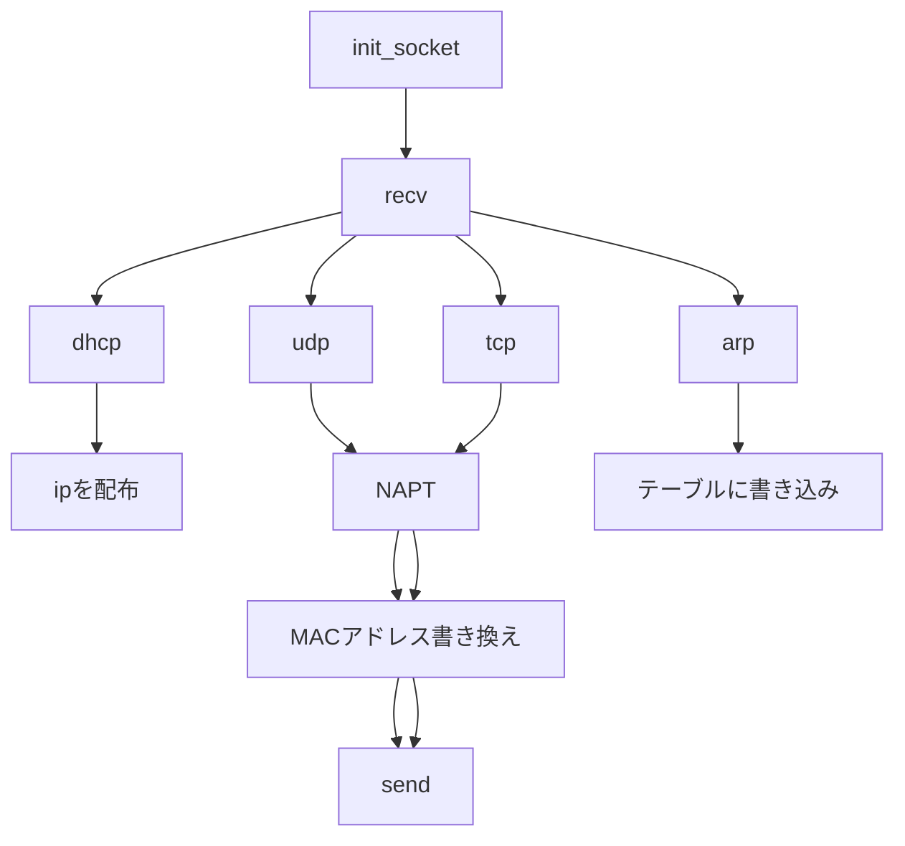

# 全体の設計
## 基本動作

```mermaid
graph TD;
    init_socket-->recv;
    recv-->dhcp-->ipを配布;
    recv-->udp-->NAPT-->MACアドレス書き換え-->send;
    recv-->tcp-->NAPT-->MACアドレス書き換え-->send;
    recv-->arp-->テーブルに書き込み
```